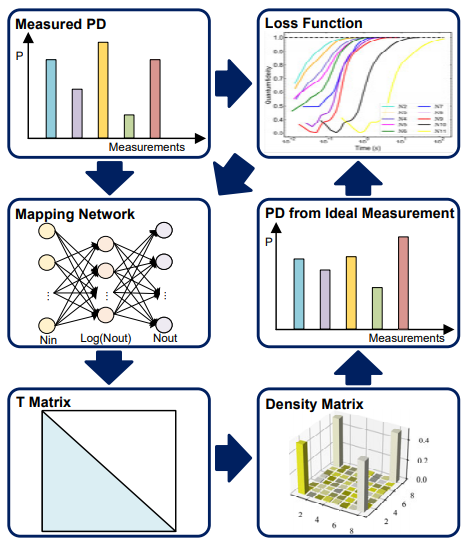

### Ultrafast quantum state tomography with feed-forward neural networks

#### Introduction

---

This code is for the paper "Ultrafast quantum state tomography with feed-forward neural networks", under review in *Quantum*, more implementations will be given after the paper is accepted.

#### File Structure

---

> ***1. Basic***: basic functions, generation of quantum states and POVMs, some loss functions;
>
> ***2. datasets***: samples data in numerical experiments;
>
> ***3. evaluation***: computation of classical fidelity and quantum fidelity;
>
> ***4. models***: the algorithm proposed in this paper (*GAN_MLE*) and some QST algorithms compared (*MLE*);
>
> ***5. results***: save various experimental results.
> 
>1. FNN: Experimental results of our algorithm on different states;
> 2. fig-M: 5-qubit random mixed state results, used to draw the reconstructed figure;

#### Method: NN-QST with the unified state-mapping method

